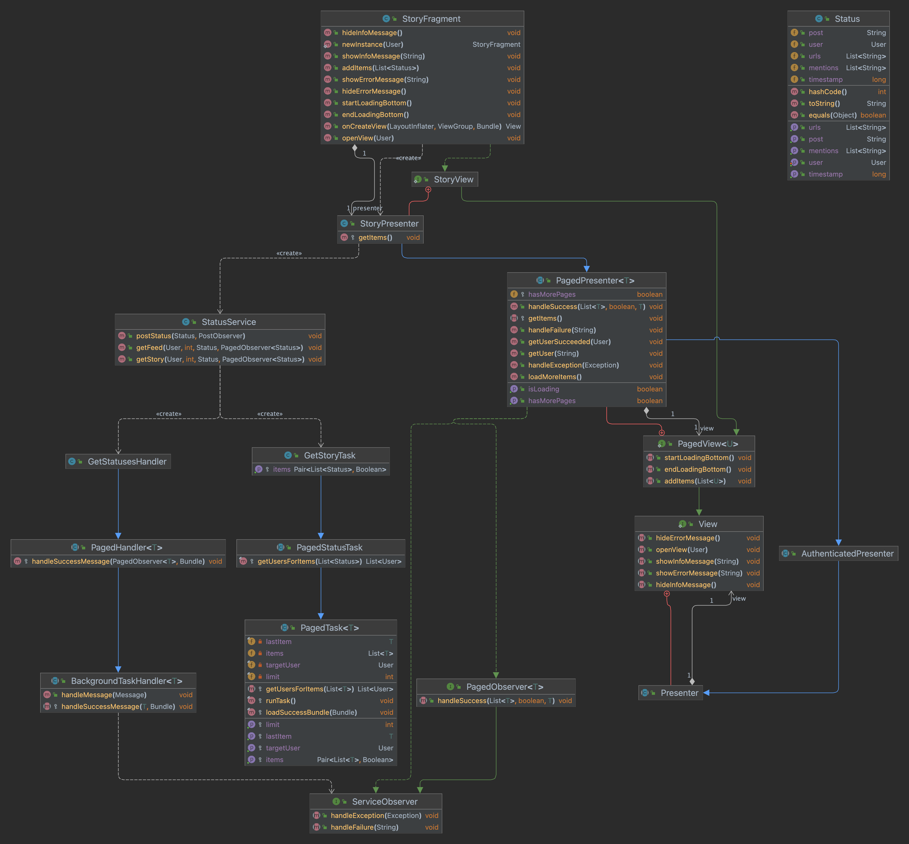
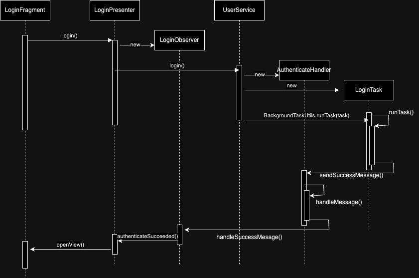

# UML
## Class Diagram

## Sequence Diagram

# Questions

- Pick one place where you used the observer pattern. Which class was the subject? Which class was the observer? Which layer did the subject belong to and which layer did the observer belong to? (Model, View, or Presenter layer)

> The observer pattern was used in the presenter layer. For example, the MainPresenter implemented the LogoutObserver (model layer). The UserService (model layer) would then pass that observer down into the handler which would then call the observer.

- Pick one place where you used generics. What class was it in? What classes can the generic type T be?

> I used generics in my PagedPresenter. It would accept User or Status as the generic.

- Pick one place where you used the template method pattern. Show the template method. What class is it in? Show the step of the algorithm that is deferred to the class's subclass. What class is it in?

> I used the template method pattern in the BackgroundTaskHandler with its handleSucessMessage method. The method was used by classes that extended it so that they could determine how to handle the success of the task.